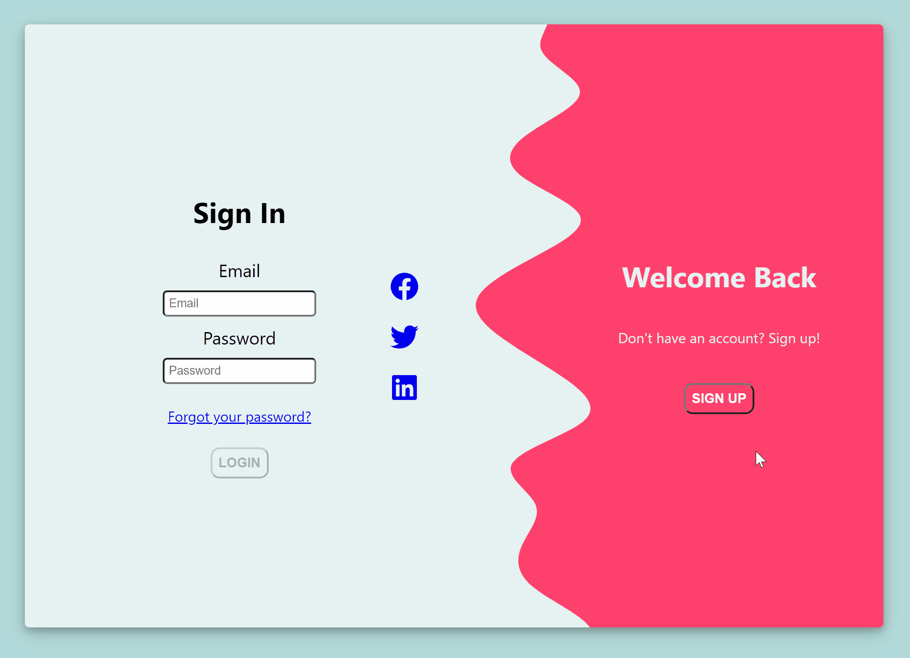

# Login/Sign-up component

I used [Florin Pop's tutorial](https://www.florin-pop.com/blog/2019/03/double-slider-sign-in-up-form/) and React.js to create a sliding login/sign-up form. 

## Installation Requirements 

- webpack
- node.js
- npm
- serve

## How to start 

Install serve using the command:
` npm install -g serve `

To start up the server, run the command:
` serve -s build `

The terminal should then direct you to the local host!

## Demo

###### This project was bootstrapped with [Create React App](https://github.com/facebook/create-react-app).

